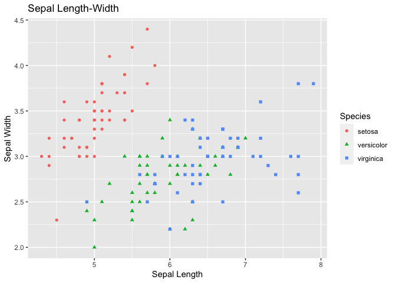

Third Blog Post
================
Xin Wang
2022-06-30

``` r
rmarkdown::render(
    '/Users/ceciliawang/Desktop/ST558/git/xinceciliaw.github.io/_Rmd/2022-06-30-third-blog-post.Rmd', 
    output_format = "github_document",
    output_dir = "/Users/ceciliawang/Desktop/ST558/git/xinceciliaw.github.io/_posts",
    output_options = list(
      html_preview = FALSE
    )
)
```

## Coolest thing about programming in R

I think the coolest thing about R is to create fancy plots and tables. I
recently learned how to use the “table 1” package and it is very neat
and useful in creating summary statistics. In terms of plots, I can’t
wait to learn how to create interactive plots by shiny app.

## Example of Table 1

``` r
library(table1)
table1(~ Sepal.Length + Sepal.Width + Petal.Length +Petal.Width | Species, data = iris)
```

## Example of ggplot

``` r
library(ggplot2)

scatter <- ggplot(data=iris, aes(x = Sepal.Length, y = Sepal.Width)) 
scatter + geom_point(aes(color=Species, shape=Species)) +
  xlab("Sepal Length") +
  ylab("Sepal Width") +
  ggtitle("Sepal Length-Width")
```

<!-- -->
